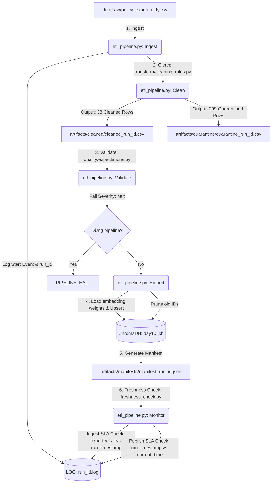

# Kiến trúc Pipeline — Lab Day 10

**Nhóm:** Team NgoDacLam-2A202600655  
**Cập nhật:** 2026-06-10

---

## 1. Sơ đồ luồng dữ liệu (Dataflow Diagram)

Dưới đây là sơ đồ luồng dữ liệu chi tiết của hệ thống từ thu nhận dữ liệu thô (Ingestion) cho tới khi hoàn tất cập nhật vào Cơ sở dữ liệu Vector (ChromaDB) kèm các điểm đo đạc và kiểm định chất lượng:

---

## 2. Ranh giới trách nhiệm

Vì dự án được phát triển và vận hành bởi **Ngô Đắc Lãm**, các vai trò cụ thể được phân chia theo module chức năng để đảm bảo tính module hóa:

| Thành phần | Input | Output | Owner | File chịu trách nhiệm |
|------------|-------|--------|-------|-----------------------|
| **Ingestion** | `policy_export_dirty.csv` (247 dòng thô) | List of Dicts (Dữ liệu thô trong RAM) | Ngô Đắc Lãm | [etl_pipeline.py](file:///c:/Users/LocND/Desktop/api/Lecture-Day-08-09-10-NgoDacLam-2A202600655/day10/lab/etl_pipeline.py) |
| **Transformation** | List of Dicts (Dữ liệu thô) | 38 dòng Cleaned CSV & 209 dòng Quarantine CSV | Ngô Đắc Lãm | [cleaning_rules.py](file:///c:/Users/LocND/Desktop/api/Lecture-Day-08-09-10-NgoDacLam-2A202600655/day10/lab/transform/cleaning_rules.py) |
| **Quality Control** | 38 dòng Cleaned CSV | Kết quả 9 bài test (Expectation Results) | Ngô Đắc Lãm | [expectations.py](file:///c:/Users/LocND/Desktop/api/Lecture-Day-08-09-10-NgoDacLam-2A202600655/day10/lab/quality/expectations.py) |
| **Embedding Engine** | `cleaned_run_id.csv` (38 dòng) | Vector Collection `day10_kb` (38 vectors) | Ngô Đắc Lãm | [etl_pipeline.py](file:///c:/Users/LocND/Desktop/api/Lecture-Day-08-09-10-NgoDacLam-2A202600655/day10/lab/etl_pipeline.py) (`_cmd_embed_internal`) |
| **Monitoring** | `manifest_run_id.json` | Freshness Status (PASS / WARN / FAIL) | Ngô Đắc Lãm | [freshness_check.py](file:///c:/Users/LocND/Desktop/api/Lecture-Day-08-09-10-NgoDacLam-2A202600655/day10/lab/monitoring/freshness_check.py) |

---

## 3. Idempotency & Rerun

Pipeline được thiết kế theo nguyên lý **Idempotency** để đảm bảo việc chạy lại (rerun) nhiều lần trên cùng một tập dữ liệu không làm sai lệch hay phình to tài nguyên lưu trữ:
1. **Upsert Strategy:** Sử dụng `chunk_id` làm khóa chính (primary key) duy nhất cho từng đoạn văn bản trong ChromaDB. Khóa này được sinh ra từ quy tắc làm sạch để đảm bảo tính nhất quán. Khi chạy lại, hàm `col.upsert` sẽ ghi đè lên vector cũ thay vì chèn mới.
2. **Pruning Strategy:** Trong mỗi phiên chạy, sau khi xác định danh sách `chunk_id` hợp lệ, pipeline sẽ gọi `col.get(include=[])` để lấy toàn bộ danh sách `ids` hiện có trong database. Bất kỳ ID nào có trong database nhưng không thuộc danh sách chạy hiện tại sẽ bị xóa ngay lập tức qua lệnh `col.delete(ids=drop)`. Điều này giúp đồng bộ hóa hoàn toàn cơ sở dữ liệu vector với tệp CSV đã làm sạch gần nhất.

---

## 4. Liên hệ với Lab Day 09

* **Tích hợp:** Dữ liệu sau khi làm sạch và vector hóa được đẩy vào ChromaDB Collection `day10_kb` sử dụng mô hình embedding chuẩn `all-MiniLM-L6-v2`.
* **Mục tiêu phục vụ:** Collection này thay thế trực tiếp cho dữ liệu tài liệu tĩnh của Day 09. Hệ thống Multi-Agent của Day 09 khi thực hiện truy vấn RAG sẽ đọc dữ liệu từ `day10_kb` để đảm bảo các câu trả lời về chính sách hoàn tiền (Refund Window), quy định ngày phép năm (Annual Leave) và quy trình IT Helpdesk luôn dựa trên thông tin chính xác nhất, đã được lọc bỏ hoàn toàn các thông tin lỗi thời (như chính sách hoàn tiền 14 ngày hoặc ngày phép cũ).

---

## 5. Rủi ro đã biết & Biện pháp giảm thiểu

1. **Rủi ro HuggingFace Hub Connection:** Quá trình tải weights mô hình `all-MiniLM-L6-v2` từ HuggingFace có thể bị lỗi mạng hoặc bị giới hạn rate-limit (hiển thị Warning về HF_TOKEN).
   * *Giảm thiểu:* Cấu hình cache local cho mô hình hoặc lưu trực tiếp thư mục weights của mô hình vào repo.
2. **Rủi ro dữ liệu nguồn quá cũ (Freshness SLA Failure):** Tập tin thô xuất ra có thuộc tính `exported_at` đã cũ hơn 24 giờ khiến hệ thống giám sát Freshness báo động đỏ (FAIL) dù pipeline chạy thành công.
   * *Giảm thiểu:* Cài đặt mức cảnh báo là `WARN` đối với Ingest Boundary và báo `FAIL` nếu Publish Boundary gặp lỗi trễ nải.
